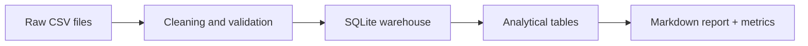

# Retail ETL Portfolio Project

Proyecto de portfolio para Big Data centrado en un flujo batch ETL reproducible.

## What it shows

- Synthetic e-commerce style data generation
- Data cleaning and validation
- Loading into a local SQLite warehouse
- Analytical SQL metrics
- Automatic report generation

## Architecture



## Project structure

- `main.py`: command-line entry point
- `src/data_generator.py`: creates raw datasets
- `src/warehouse.py`: cleaning, loading and SQL modeling
- `src/report.py`: builds the final report
- `tests/test_pipeline.py`: end-to-end and unit tests

## Requirements

- Python 3.10 or newer

The project only uses the Python standard library.

## How to run

Run the full pipeline:

```powershell
python main.py run
```

Generate only raw data:

```powershell
python main.py generate
```

Build only the report from an existing warehouse:

```powershell
python main.py report
```

## Optional parameters

You can tune the generated dataset:

```powershell
python main.py run --seed 42 --customers 80 --products 18 --days 90 --orders-per-day 8
```

Useful flags:

- `--seed`: makes the synthetic data reproducible
- `--customers`: number of customers to generate
- `--products`: number of products to generate
- `--days`: number of days in the dataset
- `--orders-per-day`: average daily order volume
- `--verbose`: shows step-by-step logs in the terminal

## Outputs

After running the pipeline you will see:

- `data/raw/`: raw CSV files
- `data/processed/`: cleaned CSV files
- `warehouse/sales.db`: SQLite warehouse
- `artifacts/report.md`: final report
- `artifacts/metrics.json`: summary metrics

## Example results

- Completed orders: 576
- Revenue: 250075.86
- Top category: Fitness
- Best day: 2024-02-11

## Why this project is useful for a portfolio

- Shows batch data engineering fundamentals
- Demonstrates SQL and data modeling
- Includes testing and reproducibility
- Generates business-oriented outputs, not just raw code

## Next improvements

1. Replace synthetic data with a real API source.
2. Add Docker for one-command reproducibility.
3. Move SQLite to PostgreSQL.
4. Add orchestration with Airflow or Prefect.
5. Add a dashboard with Streamlit or Power BI.

