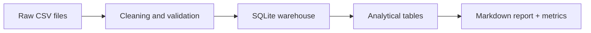

# Retail ETL Portfolio Project


Proyecto de portfolio para Big Data centrado en un flujo batch ETL reproducible.

## Overview

- Synthetic e-commerce style data generation
- Data cleaning and validation
- Loading into a local SQLite warehouse
- Analytical SQL metrics
- Automatic report generation

## Preview


## Architecture



## Project structure

- `main.py`: command-line entry point
- `src/data_generator.py`: creates raw datasets
- `src/warehouse.py`: cleaning, loading and SQL modeling
- `src/report.py`: builds the final report
- `tests/test_pipeline.py`: end-to-end and unit tests
- `assets/`: visual cover and snapshot for the README

## Requirements

- Python 3.10 or newer

The project only uses the Python standard library.

## How to run

Run the full pipeline:

```powershell
python main.py run
```

Run with logs and custom generation settings:

```powershell
python main.py run --verbose --seed 42 --customers 80 --products 18 --days 90 --orders-per-day 8
```

Generate only raw data:

```powershell
python main.py generate
```

Build only the report from an existing warehouse:

```powershell
python main.py report
```

## Run with Docker

Build the image:

```powershell
docker build -t retail-etl-portfolio .
```

Run it in a disposable container:

```powershell
docker run --rm -v "${PWD}:/app" retail-etl-portfolio
```

Or use Docker Compose:

```powershell
docker compose up --build
```

The compose setup mounts the current project folder into the container, so the generated `data/`, `warehouse/` and `artifacts/` folders remain available on your machine.

If Docker Desktop is not installed yet, install it first and then rerun the commands above.

## Outputs

After running the pipeline you will see:

- `data/raw/`: raw CSV files
- `data/processed/`: cleaned CSV files
- `warehouse/sales.db`: SQLite warehouse
- `artifacts/report.md`: final report
- `artifacts/metrics.json`: summary metrics

## Current results

- Completed orders: 576
- Revenue: 250075.86
- Top category: Fitness
- Best day: 2024-02-11

## Future configuration

The project currently uses SQLite, but `.env.example` is already included to make a future move to PostgreSQL or another database straightforward.

Copy it to `.env` when you need it:

```powershell
Copy-Item .env.example .env
```

## Why this project is useful for a portfolio

- Shows batch data engineering fundamentals
- Demonstrates SQL and data modeling
- Includes testing and reproducibility
- Generates business-oriented outputs, not just raw code

## Next improvements

1. Replace synthetic data with a real API source.
2. Add Docker for one-command reproducibility.
3. Move SQLite to PostgreSQL.
4. Add orchestration with Airflow or Prefect.
5. Add a dashboard with Streamlit or Power BI.
